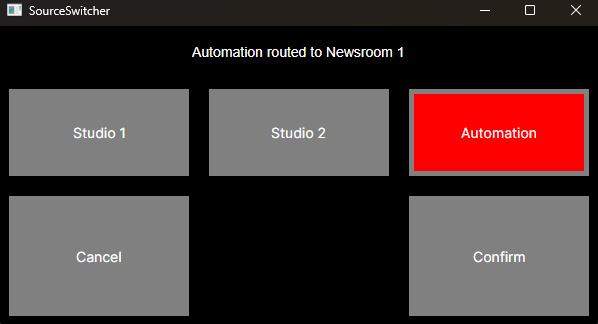

# RemoteRelay
A remotely controlled relay switcher, primarily designed for switching the active output in a radio studio seamlessly. 

## Architecture
### Server
The server is designed to run on Raspberry Pi, and should work on the entire suite of devices from Pi 1 through to Pi 5 as long as there is a compatible relay HAT plugged in. For example, this https://www.waveshare.com/rpi-relay-board.htm works great on the Pi 5.
The server deals with all GPI operations and holds the state of the system. Client-Server communication is performed via SignalR across the network. Upon receiving a switch command, the system will switch the relay that is active on the HAT, before then updating all connected clients to show the new state
### Client
A platform-agnostic client built in Avalonia, that so far has been tested on Windows and Linux. This app connects to a running server, downloads the configuration file, and then renders the UI based on the system setup. 

The client UI is designed for a pi connected to a touch screen, with the idea that a small touch screen can be installed in a studio for easy access and use. 

## Setup
### Server
- Image a Pi with the latest Raspberry Pi OS desktop image (for a server only system, Lite should be fine, but you can run the client and server on the same physical system)
- Build and Publish RemoteRelay.Server (there are publish tasks currently for linux-arm64)
- Copy the RemoteRelay.Server application to the Pi
- Modify the config.json file
	- Add correct definitions for the sources/options
	- Set the correct pin numbers (logical addressing is used)
- chmod +x the server binary
- Run the server application
- (Optional) Create a service for the server so it survives reboots

### Client 
- Image a Pi with the latest Raspberry Pi OS desktop image 
- Build and Publish RemoteRelay
- Copy the published RemoteRelay application to the Pi
- Set the server details in ServerDetails.json
- chmod +x the client binary
- Run the client application
- (Optional) Set the application to launch when the pi boots up

## To-Do
- Add support for sending a TCP message to a different service on switch (this could be for triggering a Hot Spare switch in Zetta, a Smart Transfer in Myriad, or for updating digital studio signage)
- Add support for multiple outputs (Allowing Studio 1 to be routed to Output 1, Studio 2 to Output 2 etc from the same screen)
- Add support for multiple servers (Because one relay HAT isn't enough!)